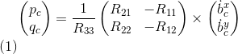

# FCND-P3-3D-Quadrotor-Controller
Udacity Flying Car Nanodegree -  Project 3 - 3D Quadrotor Controller

In this project, I have implement and tuned a [cascade PID controller](https://controlstation.com/cascade-control-cascade-control-configured/) for drone trajectory tracking. The theory behind the controller design using feed-forward strategy is explained in details on Udacity's instructor, [Angela P. Schoellig](http://www.dynsyslab.org/prof-angela-schoellig/), on her paper [Feed-Forward Parameter Identification for Precise Periodic
Quadrocopter Motions](http://www.dynsyslab.org/wp-content/papercite-data/pdf/schoellig-acc12.pdf). The following diagram could be found in the course content describing the cascaded control loops of the trajectory-following controller:


The idea is to start with tuning and building the inner most controller first. Then the controllers dependent on it are tuned further. The project gives the intuition of how going from innermost to outer controller building takes place in practice.  

# Project description

A casaded controller needs to be implemented for this project using C++ so that the quad can follow the commanded trajectory. The controller should be able to handle deviations like heavier mass than what the model accounted for or an offset in the quad's center of mass. The quad should operate within the dynamic and legal constraints.   

## Overview of the project

Udacity provides a [seed project](https://github.com/udacity/FCND-Controls-CPP) with the simulator implementation and placeholders for the controller code. The seed project README.md give guides to run the project and information of the task we need to execute for implementing the controller. There are five scenarios we need to cover. The simulator runs in a loop on the current scenario and show on the standard output an indication the scenario pass or not.

All the C++ code is in the [/src](./src) directory. The more interesting files are:

- [/config/QuadControlParams.txt](./config/QuadControlParams.txt): This file contains the configuration for the controller. While the simulator is running, you can modify and save changes to this file, and the simulator will "refresh" those parameters on the next loop execution.
- [/src/QuadControl.cpp](./src/QuadControl.cpp): This is where all the fun is because this is where the controller logic and dynamic model of the quad is implemented in code.

### Prerequisites

Nothing extra needs to install but the IDE is necessary to compile the code. In my case Microsoft Visual Studio 2019 because I am using Windows. Please, follow the instructions on the [seed project README.md](https://github.com/udacity/FCND-Controls-CPP).

### Run the code

Following the instruction on the seed project, load the project on the IDE. Remember the code is on [/src](./src).

#### Scenario 1: Intro

In this scenario, we adjust the mass of the drone in [/config/QuadControlParams.txt](./config/QuadControlParams.txt) until it hovers for a bit:


This video is [Scenario_1.mp4](./videos/Scenario_1.mp4)

When the scenario is passing the test, you should see this line on the standard output:

```
PASS: ABS(Quad.PosFollowErr) was less than 0.500000 for at least 0.800000 seconds
```

#### Scenario 2: Body rate and roll/pitch control

We begin by establishing a relation between the rotor forces and (a) Required net force in z direction; (b) Required net torque along the quad's local frame's x, y, z axes. This will enable the drone to adjust the rotor speed according to the net forces and torque on the system commanded by the controller. The [GenerateMotorCommands method](./src/QuadControl.cpp#L56-L98) needs to be programmed resolving these equations:


Where all `kf*(omega_1^2)` would be the motor's thrust at the first rotor, `I_x*u_p_bar` would be the net torque along the x-axis, `c_bar*kf` is the total thrust, kappa is the drag/thrust ratio (`kappa=km/kf`) and `l` is the drone arm length over square root of two. These equations come from the classroom lectures. There are a couple of things to consider. For example, on NED coordinates the `z` axis is inverted that is why the moment on `z` was inverted here. Another thing to note is the numbering of the rotors: front left->(1); front right->(2); rear right->(3); rear left->(4).

Now is the time to start coding the controller. Here we deal with the innermost Attitude controller which further contains the following three controllers within it: 


In scenario 2, simulator gives the drone an initial disturbance: an initial angular velocity about x axis. Task is to do something so that the angular velocity goes back to zero (acheived by Body rate controller) and the angular positon about x axis (roll) goes back to zero (achieved by roll, pitch and yaw controllers). 

Ideally the Body rate controller will receive the commanded angular velocity from roll, pitch and yaw controllers but that'll happen when all four of those controllers are functional. We get started by ignoring roll, pitch and yaw controllers and manually command the Body Rate Controller to maintain zero angular velocity and tune it. Once it responds to this command, we start setting up roll, pitch and yaw controllers to give it the angular velocities desired to make roll, pitch, yaw back to zero (which is again a manual command). These controllers will obtain commands from higher level controllers (Lateral and Altitude controllers) to compute the desired values of roll, pitch and yaw. 

The first step is to implement the [BodyRateControl method](./src/QuadControl.cpp#L100-L130) applying a [P controller](https://en.wikipedia.org/wiki/Proportional_control). At this point, the `kpPQR` parameter has to be tuned to stop the drone from flipping, but first, some thrust needs to be commanded in the altitude control because we don't have thrust commanded on the `GenerateMotorCommands` anymore. A good value is `thurst = mass * CONST_GRAVITY` (this is chosen to simply things by commanding the drone to just balance the gravitational force with no intent of acelerating in the z direction)

Once this is done, we move on to the [RollPitchControl method](./cpp/src/QuadControl.cpp#L124-L167) (because the initial disturbance was given along the x axis). For this implementation, you need to apply a few equations. You need to apply a P controller to the elements `R13` and `R23` of the [rotation matrix](https://en.wikipedia.org/wiki/Rotation_matrix) from body-frame accelerations and world frame accelerations:


Here the subscript a and c denote actual and commanded values respectively. Now, as we need to output roll and pitch rates, there is another equation to apply:



It is important to notice you have received the magnitude of thrust in the function arguments. This needs to be inverted and converted to acceleration with a proper sign before applying the equations (as z-acceleration is positive downwards). 

Another thing to make sure is constraining the maximum tilt in the roll and pitch angle. This can be applied on `b_x` and `b_y` due to the fact that if you apply small angle approximations, they tend to `theta` and `-phi` respectively.

After the implementation is done, start tuning `kpBank` and `kpPQR` until the drone corrects its roll and angular velocity along x axis:


This video is [Scenario_2.mp4](./videos/Scenario_2.mp4)

When the scenario is passing the test, you should see this line on the standard output:

```
PASS: ABS(Quad.Roll) was less than 0.025000 for at least 0.750000 seconds
PASS: ABS(Quad.Omega.X) was less than 2.500000 for at least 0.750000 seconds
```

#### Scenario 3: Position/velocity and yaw angle control

There are three methods to implement here:

- [AltitudeControl](./src/QuadControl.cpp#L191-L236): This is a feedforward [PID controller](https://en.wikipedia.org/wiki/PID_controller) to control the acceleration meaning the thrust needed to control the altitude. `P` term helps in correcting the deviation from the desired position. `D` term reduces the oscillations at the equilibrium position and slows down the quad to attain stability. `I` term helps in correcting the residual error from the equilibrium behaviour when PD controller is not able to bring the quad to desired position and velocity. 

Following are the equations of motion realted to this controller: 


It is important to notice the difference between the [constraints imposed on velocity](./src/QuadControl.cpp#L216) vs [constraints imposed on acceleration](./src/QuadControl.cpp#L346-L347). Accelerations can be directly controlled by changing the net force by varying the omegas of rotors. So this constraint can be put after finding the output from the PID controller. If the controller asks for a=2.2 m/s^2 and quad is only capable of providing 2 m/s^2, the desired acceleration can be overwritten by this threshold. This is not the case for velocity constrains. Let's say, we need a velocity higher than maxAscentRate. We give it to the controller and it generates some acceleration to achieve it. Now, that would result in the increase in velocity. Now if it already has some acceleration, the quad's velocity cannot be changed immediately if it surpasses the maximum velocity threshold even by instantaneously changing the acceleration. To avoid that, the commanded velocity should be kept in check so that the quad never crosses the threshold.

To test this, go back to scenario 2 and make sure the drone doesn't fall. In that scenario, the desired z position is set at some constant value with zero net velocity and acceleration. In this case, the thrust should be `mass * CONST_GRAVITY`.

- [LateralPositionControl](./src/QuadControl.cpp#L239-L306): This is [cascaded proportional controller](./Double_Integrator_Control__Cascaded_P_Controller_Gains_vs_Damping_Ratio.pdf) (inner one to get velocity and an outer one to get acceleration) to control acceleration on `x` and `y`. This helps us in tuning the parameters as there exists a relation between gains for a critically damped condition (`Kv`/`Kp` ~ 4). 
 
It is important to note the way velocity and accleration constrainsts have been applied in the X-Y plane. Recall that while finding the magnitude a vector, if each component is scaled by a factor `k` then the magnitude of the whole vector gets scaled by `k`. To limit the net velocity and acceleration in X-Y plane, a downscaling factor needs to be calculated so that net vector's magnitude stays within the constrained values.   

- [YawControl](./src/QuadControl.cpp#L309-L337): This is a simpler case because it is P controller (as yaw is being related to its first derivative only). It is better to optimize the yaw to be between `[0, 2*pi]`. This will ensure that the difference between actual and commanded yaw would lie between `[-2*pi, 2*pi]`. For instance, if this is not done, the difference of `2*pi` and `4*pi` might mean the same mathematically, but would command higher magnitude of angular velocity along the z axis. 

Note: Avoid changing the gains of the controller that were already tuned. We go from tuning the innermost controller to the outermost chronologically. Here is a video of the scenario when it passes:


This video is [Scenario_3.mp4](./videos/Scenario_3.mp4)

When the scenario is passing the test, you should see this line on the standard output:

```
PASS: ABS(Quad1.Pos.X) was less than 0.100000 for at least 1.250000 seconds
PASS: ABS(Quad2.Pos.X) was less than 0.100000 for at least 1.250000 seconds
PASS: ABS(Quad2.Yaw) was less than 0.100000 for at least 1.000000 seconds
```

#### Scenario 4: Non-idealities and robustness

This is a fun scenario. Everything is almost coded and tuned already (given that Integral term was added while designing the Altitude controller). Minor tweaking of the gains might be required here though. If the quad with off-center COM is drifting way too much from the straight line joining the start and end point, increasing the proportional gain will help to apply stronger force to reduce deviation. If it starts overshooting the target increasing the differential gain term would help to quickly change the velocity. If the heavier quad is sinking downwards, increasing the proportional term will help in getting it up during its motion. Increasing the integral term will help in correcting the z-position at the final position if it is still lower than the desired height. Here's how the result of this scenario will look like:


This video is [Scenario_4.mp4](./videos/Scenario_4.mp4)

When the scenario is passing the test, you should see this line on the standard output:

```
PASS: ABS(Quad1.PosFollowErr) was less than 0.100000 for at least 1.500000 seconds
PASS: ABS(Quad2.PosFollowErr) was less than 0.100000 for at least 1.500000 seconds
PASS: ABS(Quad3.PosFollowErr) was less than 0.100000 for at least 1.500000 seconds
```

#### Scenario 5: Tracking trajectories

At this point, the yellow quad will most likely follow the figure eight shaped trajectory. You can play with the gains to decrease the settling time (increasing the proportional gains will help). You might not be able to ace this scenario if the constraints are not put on the various state variables of the quad. This might result into random behavior of the drone once those constraints are surpassed. 

The extra challenge in this scenario is to complete the trajectory planning for the red colored quad. It only has the position command at various time stamps. Various approaches can be adopted to calculate the velocity values at each waypoint the quad needs to follow. This can be done in [Generate_pos_vel_Fig_8.ipynb](./config/traj/Generate_pos_vel_Fig_8.ipynb) by assigning values to `vx`, `vy`, `vz`. After running this python script, red drone's [trajectory file](./config/traj/FigureEight.txt) will get updated with the velocity information. This additon will provide the feed-forward velocity terms in the controller equations. The yellow drone's [trajectory file](./config/traj/FigureEightFF.txt) already contains the velocity information. 


This video is [Scenario_5.mp4](./videos/Scenario_5.mp4)

When the scenario is passing the test, you should see this line on the standard output:

```
PASS: ABS(Quad2.PosFollowErr) was less than 0.250000 for at least 3.000000 seconds
```

#### Scenario 6: Multi Drone Trajectory Tracking
There is one more optional scenario on this project. If the above scenarios were programmed and tuned correctly, this would be a cake-walk. Here is the video of this scenario:


This video is [Scenario_6.mp4](./videos/Scenario_6.mp4)

# [Project Rubric](https://review.udacity.com/#!/rubrics/1643/view)

## Writeup
### Provide a Writeup / README that includes all the rubric points and how you addressed each one. You can submit your write-up as markdown or pdf.

This markdown is the write-up.

## Implemented Controller

### Implemented body rate control in C++.

The body rate control is implemented as proportional control in [/src/QuadControl::BodyRateControl method ](/src/QuadControl.cpp#L100-L130) from line 100 to 130 using C++.

### Implement roll pitch control in C++.

The roll pitch control is implemented in [/src/QuadControl::RollPitchControl method ](/src/QuadControl.cpp#L133-L189) from line 133 to 189 using C++.

### Implement altitude controller in C++.

The altitude control is implemented in [/src/QuadControl::AltitudeControl method ](/src/QuadControl.cpp#L191-L236) from line 191 to 236 using C++.

### Implement lateral position control in C++.

The lateral position control is implemented in [/src/QuadControl::LateralPositionControl method ](/src/QuadControl.cpp#L239-L305) from line 239 to 305 using C++.

### Implement yaw control in C++.

The yaw control is implemented in [/src/QuadControl::YawControl method ](/src/QuadControl.cpp#L309-L337) from line 309 to 337 using C++.

### Implement calculating the motor commands given commanded thrust and moments in C++.

The calculation implementation for the motor commands is in [/src/QuadControl::GenerateMotorCommands method ](/src/QuadControl.cpp#L56-L98) from line 56 to 98.

## Flight Evaluation


### Your C++ controller is successfully able to fly the provided test trajectory and visually passes the inspection of the scenarios leading up to the test trajectory.

> Ensure that in each scenario the drone looks stable and performs the required task. Specifically check that the student's controller is able to handle the non-linearities of scenario 4 (all three drones in the scenario should be able to perform the required task with the same control gains used).

The implementation pass scenarios 1 - 5 on the C++ simulator:

```
# Scenario 1
PASS: ABS(Quad.PosFollowErr) was less than 0.500000 for at least 0.800000 seconds
# Scenario 2
PASS: ABS(Quad.Roll) was less than 0.025000 for at least 0.750000 seconds
PASS: ABS(Quad.Omega.X) was less than 2.500000 for at least 0.750000 seconds
# Scenario 3
PASS: ABS(Quad1.Pos.X) was less than 0.100000 for at least 1.250000 seconds
PASS: ABS(Quad2.Pos.X) was less than 0.100000 for at least 1.250000 seconds
PASS: ABS(Quad2.Yaw) was less than 0.100000 for at least 1.000000 seconds
# Scenario 4
PASS: ABS(Quad1.PosFollowErr) was less than 0.100000 for at least 1.500000 seconds
PASS: ABS(Quad2.PosFollowErr) was less than 0.100000 for at least 1.500000 seconds
PASS: ABS(Quad3.PosFollowErr) was less than 0.100000 for at least 1.500000 seconds
# Scenario 5
PASS: ABS(Quad2.PosFollowErr) was less than 0.250000 for at least 3.000000 seconds
```