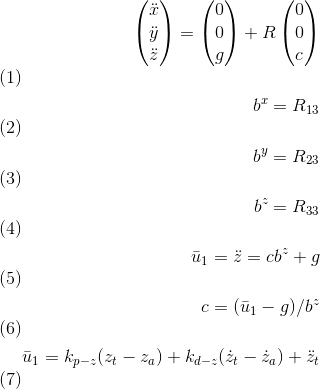

# FCND-P3-3D-Quadrotor-Controller
Udacity Flying Car Nanodegree -  Project 3 - 3D Quadrotor Controller

In this project, I have implement and tuned a [cascade PID controller](https://controlstation.com/cascade-control-cascade-control-configured/) for drone trajectory tracking. The theory behind the controller design using feed-forward strategy is explained in details on Udacity's instructor, [Angela P. Schoellig](http://www.dynsyslab.org/prof-angela-schoellig/), on her paper [Feed-Forward Parameter Identification for Precise Periodic
Quadrocopter Motions](http://www.dynsyslab.org/wp-content/papercite-data/pdf/schoellig-acc12.pdf). The following diagram could be found in the course content describing the cascaded control loops of the trajectory-following controller:


The idea is to start with tuning and buildng the inner most controller first. Then the controllers dependent on it are tuned further. The project gives the intuition of how going from innermost to outer controller building takes place in practice.  

# Project description

A casaded controller needs to be implemented for this project using C++. 

## Overview of the project

Udacity provides a [seed project](https://github.com/udacity/FCND-Controls-CPP) with the simulator implementation and placeholders for the controller code. The seed project README.md give guides to run the project and information of the task we need to execute for implementing the controller. There are five scenarios we need to cover. The simulator runs in a loop on the current scenario and show on the standard output an indication the scenario pass or not.

All the C++ code is in the [/src](./src) directory. The more interesting files are:

- [/config/QuadControlParams.txt](./config/QuadControlParams.txt): This file contains the configuration for the controller. While the simulator is running, you can modify and save changes to this file, and the simulator will "refresh" those parameters on the next loop execution.
- [/src/QuadControl.cpp](./src/QuadControl.cpp): This is where all the fun is because this is where the controller logic and dynamic model of the quad is implemented in code.

### Prerequisites

Nothing extra needs to install but the IDE is necessary to compile the code. In my case Microsoft Visual Studio 2019 because I am using Windows. Please, follow the instructions on the [seed project README.md](https://github.com/udacity/FCND-Controls-CPP).

### Run the code

Following the instruction on the seed project, load the project on the IDE. Remember the code is on [/src](./src).

#### Scenario 1: Intro

In this scenario, we adjust the mass of the drone in [/config/QuadControlParams.txt](./config/QuadControlParams.txt) until it hovers for a bit:


This video is [Scenario_1.mp4](./videos/Scenario_1.mp4)

When the scenario is passing the test, you should see this line on the standard output:

```
PASS: ABS(Quad.PosFollowErr) was less than 0.500000 for at least 0.800000 seconds
```

#### Scenario 2: Body rate and roll/pitch control

We begin by establishing a relation between the rotor forces and the (a) Required net fore in z direction; (b) Required net torque along x, y, z axes. This is enable the drone to adjust the rotor speed according to how the controller commands to net forces and torque to be on the system. The [GenerateMotorCommands method](./src/QuadControl.cpp#L56-L98) needs to be coded resolving this equations:


Where all the `kf*(omega_1^2)` to `kf*(omega_1^2)` would be the motor's thrust at each rotor, `I_x*u_p_bar` would be the moments along the x direction, `c_bar*kf` is the total thrust, kappa is the drag/thrust ratio and `l` is the drone arm length over square root of two. These equations come from the classroom lectures. There are a couple of things to consider. For example, on NED coordinates the `z` axis is inverted that is why the moment on `z` was inverted here. Another thing to note is the numbering of the rotors: front left->(1); front right->(2); rear right->(3); rear left->(4).

Now is the time to start coding the controller. Here we deal with the innermost Attitude controller which further contains the following three controllers within it: 


In scenario 2, simulator gives the drone an initial disturbance: an initial angular velocity about x axis. Task is to do something so that the angular velocity goes back to zero (acheived by Body rate controller) and the angular positon about x axis (roll) goes back to zero (achieved by roll, pitch and yaw controllers). 

Ideally the Body rate controller will receive the commanded angular velocity from roll, pitch and yaw controllers but that'll happen when all four of those controllers are functional. We get started by ignoring roll, pitch and yaw controllers and manually command the Body Rate Controller to maintain zero angular velocity and tune it. Once it responds to this command, we start setting up roll, pitch and yaw controllers to give it the angular velocities desired to make roll, pitch, yaw back to zero (which is again a manual command). These controllers will obtain obtain commands from higher level controllers (Lateral and Altitude controllers) to compute the desired values of roll, pitch and yaw. 

The first step is to implement the [BodyRateControl method](./src/QuadControl.cpp#L100-L130) applying a [P controller](https://en.wikipedia.org/wiki/Proportional_control) and the moments of inertia. At this point, the `kpPQR` parameter has to be tuned to stop the drone from flipping, but first, some thrust needs to be commanded in the altitude control because we don't have thrust commanded on the `GenerateMotorCommands` anymore. A good value is `thurst = mass * CONST_GRAVITY` (this is chosen to simply things by commanding the drone to just balance the gravitational force with no intent of acelerating in the z direction)

Once this is done, we move on to the [RollPitchControl method](./cpp/src/QuadControl.cpp#L124-L167) (because the initial disturbance was given along the x axis). For this implementation, you need to apply a few equations. You need to apply a P controller to the elements `R13` and `R23` of the [rotation matrix](https://en.wikipedia.org/wiki/Rotation_matrix) from body-frame accelerations and world frame accelerations:


Here the subscript a and c denote actual and commanded values respectively. Now, as we need to output roll and pitch rates, there is another equation to apply:


It is important to notice you have received the magnitude of thrust in the function arguments. This it need to be inverted and converted to acceleration before applying the equations (as z-acceleration is positive downwards). After the implementation is done, start tuning `kpBank` and `kpPQR` until the drone flies more or less stable upward:


This video is [Scenario_2.mp4](./videos/Scenario_2.mp4)

When the scenario is passing the test, you should see this line on the standard output:

```
PASS: ABS(Quad.Roll) was less than 0.025000 for at least 0.750000 seconds
PASS: ABS(Quad.Omega.X) was less than 2.500000 for at least 0.750000 seconds
```

#### Scenario 3: Position/velocity and yaw angle control

There are three methods to implement here:

- [AltitudeControl](./cpp/src/QuadControl.cpp#L169-L212): This is a [PD controller](https://en.wikipedia.org/wiki/PID_controller) to control the acceleration meaning the thrust needed to control the altitude.



To test this, go back to scenario 2 and make sure the drone doesn't fall. In that scenario, the PID is configured not to act, and the thrust should be `mass * CONST_GRAVITY`.

- [LateralPositionControl](./cpp/src/QuadControl.cpp#L215-L267) This is another PID controller to control acceleration on `x` and `y`.

- [YawControl](./cpp/src/QuadControl.cpp#L270-L302): This is a simpler case because it is P controller. It is better to optimize the yaw to be between `[-pi, pi]`.

Once all the code is implemented, put all the `kpYaw`,`kpPosXY`, `kpVelXY`, `kpPosZ` and `kpVelZ` to zero. Take a deep breath, and start tuning from the altitude controller to the yaw controller. It takes time. Here is a video of the scenario when it passes:


This video is [cpp-scenario-3.mov](./videos/cpp-scenario-3.mov)

When the scenario is passing the test, you should see this line on the standard output:

```
PASS: ABS(Quad1.Pos.X) was less than 0.100000 for at least 1.250000 seconds
PASS: ABS(Quad2.Pos.X) was less than 0.100000 for at least 1.250000 seconds
PASS: ABS(Quad2.Yaw) was less than 0.100000 for at least 1.000000 seconds
```

#### Scenario 4: Non-idealities and robustness

This is a fun scenario. Everything is coded and tuned already, right? Ok, we need to add an integral part to the altitude controller to move it from PD to PID controller. What happens to me here is that everything starts not working correctly, and I have to tune everything again, starting from scenario -1. Remember patience is a "virtue", and to it again. If you cannot and get frustrated talk to your peers, they will be able to give you hints. It is hard but doable:


This video is [cpp-scenario-4.mov](./videos/cpp-scenario-4.mov)

When the scenario is passing the test, you should see this line on the standard output:

```
PASS: ABS(Quad1.PosFollowErr) was less than 0.100000 for at least 1.500000 seconds
PASS: ABS(Quad2.PosFollowErr) was less than 0.100000 for at least 1.500000 seconds
PASS: ABS(Quad3.PosFollowErr) was less than 0.100000 for at least 1.500000 seconds
```

#### Scenario 5: Tracking trajectories

This is the final non-optional scenario. The drone needs to follow a trajectory. It will show all the errors in your code and also force you to tune some parameters again. Remember there are comments on the controller methods regarding limits that need to be imposed on the system. Here those limits are required in order to pass.


This video is [cpp-scenario-5.mov](./videos/cpp-scenario-5.mov)

When the scenario is passing the test, you should see this line on the standard output:

```
PASS: ABS(Quad2.PosFollowErr) was less than 0.250000 for at least 3.000000 seconds
```

There are a few optional scenarios on this project, but I was exhausted. Too many long hours were tuning parameters and finding bugs. There should be a lot of room for improvement. Here is the video of a multi-drone scenario:


No idea why some of them go nuts!!!!! (and then come back to the "formation".)

**Post submit note** The tilt angle limit enforcing was missing on the `RollPitchControl`. Here is a video with no-crazy drones:


Here is the [video](./videos/cpp-scenario-multi-drone-1.gif).

# [Project Rubric](https://review.udacity.com/#!/rubrics/1643/view)

## Writeup
### Provide a Writeup / README that includes all the rubric points and how you addressed each one. You can submit your write-up as markdown or pdf.

This markdown is the write-up.

## Implemented Controller

### Implemented body rate control in python and C++.

The body rate control is implemented as proportional control in [/python/controller.py body_rate_control method](./python/controller.py#L179-L195) from line 179 to 195 using Python and in [/cpp/src/QuadControl::BodyRateControl method ](/cpp/src/QuadControl.cpp#L95-L121) from line 95 to 121 using C++.

### Implement roll pitch control in python and C++.

The roll pitch control is implemented in [/python/controller.py roll_pitch_controller method](./python/controller.py#L142-L177) from line 142 to 177 using Python and in [/cpp/src/QuadControl::RollPitchControl method ](/cpp/src/QuadControl.cpp#L124-L167) from line 124 to 167 using C++.

### Implement altitude control in python.

The altitude control is implemented in [/python/controller.py altitude_control method](./python/controller.py#L112-L139) from line 112 to 139 using Python.

### Implement altitude controller in C++.

The altitude control is implemented in [/cpp/src/QuadControl::AltitudeControl method ](/cpp/src/QuadControl.cpp#L169-L212) from line 169 to 212 using C++.

### Implement lateral position control in python and C++.

The lateral position control is implemented in [/python/controller.py lateral_position_control method](./python/controller.py#L93-L124) from line 93 to 124 using Python and in [/cpp/src/QuadControl::LateralPositionControl method ](/cpp/src/QuadControl.cpp#L215-L267) from line 215 to 267 using C++.

### Implement yaw control in python and C++.

The yaw control is implemented in [/python/controller.py yaw_control method](./python/controller.py#L197-L214) from line 197 to 214 using Python and in [/cpp/src/QuadControl::YawControl method ](/cpp/src/QuadControl.cpp#L270-L302) from line 270 to 302 using C++.

### Implement calculating the motor commands given commanded thrust and moments in C++.

The calculation implementation for the motor commands is in [/cpp/src/QuadControl::GenerateMotorCommands method ](/cpp/src/QuadControl.cpp#L58-L93) from line 58 to 93.

## Flight Evaluation

### Your python controller is successfully able to fly the provided test trajectory, meeting the minimum flight performance metrics.

> For this, your drone must pass the provided evaluation script with the default parameters. These metrics being, your drone flies the test trajectory faster than 20 seconds, the maximum horizontal error is less than 2 meters, and the maximum vertical error is less than 1 meter.

The Python implementation meets the minimum flight performance metrics:

```
Maximum Horizontal Error:  1.896498169249138
Maximum Vertical Error:  0.636822964449316
Mission Time:  2.121786
Mission Success:  True
```

Telemetry files are provided on the [/python/telemetry](./python/telemetry) directory.

### Your C++ controller is successfully able to fly the provided test trajectory and visually passes the inspection of the scenarios leading up to the test trajectory.

> Ensure that in each scenario the drone looks stable and performs the required task. Specifically check that the student's controller is able to handle the non-linearities of scenario 4 (all three drones in the scenario should be able to perform the required task with the same control gains used).

The implementation pass scenarios 1 - 5 on the C++ simulator:

```
# Scenario 1
PASS: ABS(Quad.PosFollowErr) was less than 0.500000 for at least 0.800000 seconds
# Scenario 2
PASS: ABS(Quad.Roll) was less than 0.025000 for at least 0.750000 seconds
PASS: ABS(Quad.Omega.X) was less than 2.500000 for at least 0.750000 seconds
# Scenario 3
PASS: ABS(Quad1.Pos.X) was less than 0.100000 for at least 1.250000 seconds
PASS: ABS(Quad2.Pos.X) was less than 0.100000 for at least 1.250000 seconds
PASS: ABS(Quad2.Yaw) was less than 0.100000 for at least 1.000000 seconds
# Scenario 4
PASS: ABS(Quad1.PosFollowErr) was less than 0.100000 for at least 1.500000 seconds
PASS: ABS(Quad2.PosFollowErr) was less than 0.100000 for at least 1.500000 seconds
PASS: ABS(Quad3.PosFollowErr) was less than 0.100000 for at least 1.500000 seconds
# Scenario 5
PASS: ABS(Quad2.PosFollowErr) was less than 0.250000 for at least 3.000000 seconds
```